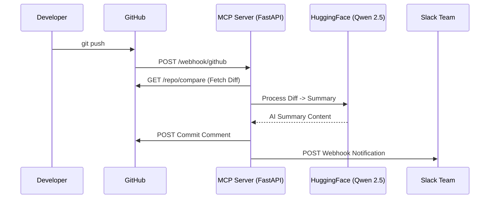

# 🚀 Git Push Summarizer (MCP Webhook Agent)

A powerful automation server that listens for GitHub **push** events, uses the **Qwen/Qwen2.5-72B-Instruct** model to generate intelligent summaries of code changes, and broadcasts them to your team via GitHub and Slack.

---

## ✨ Features

- **Autonomous Logic**: Runs automatically on every `git push`—no manual PR creation required.
- **AI-Powered Summaries**: Generates senior-engineer style summaries using Qwen 2.5 via HuggingFace Inference API.
- **Double-Channel Notification**: 
    - 📝 Posts a **Commit Comment** directly on the GitHub commit.
    - 💬 Sends a formatted **Slack Message** to your team channel.


---

## 🏗️ Architecture


## 🎯 Why This Project Exists

Modern teams push code frequently, but:

- Commit messages are often short or unclear  
- Team members struggle to understand changes quickly  
- Managers and reviewers waste time reading diffs  
- Communication gaps slow collaboration  

While tools like GitHub Copilot assist developers during coding, their explanations and summaries are **not fully customizable** to match a team's workflow, communication style, or reporting needs.

**Git Push Summarizer solves this automatically.**

- Generates AI explanations tailored to your own prompt design and engineering standards  
- Allows full customization of how summaries are written, structured, and shared  
- Integrates directly into existing team communication channels

Every push becomes a **senior-engineer style explanation**.


---

## 🛠️ Setup & Installation

### 1. Prerequisites
- Python 3.10+
- [ngrok](https://ngrok.com/) (for local testing)
- GitHub Personal Access Token (PAT)
- HuggingFace API Token ([Get it here](https://huggingface.co/settings/tokens))

### 2. Clone and Setup
```bash
git clone https://github.com/ThivankaD/MCP.git
cd MCP/pr_agent_server
python -m venv venv
.\venv\Scripts\Activate.ps1
pip install -r requirements.txt
```

### 3. Environment Configuration
Create a `.env` file in the `pr_agent_server` directory:

```env
GITHUB_TOKEN=ghp_your_github_token
HF_API_KEY=hf_your_huggingface_token
SLACK_WEBHOOK_URL=https://hooks.slack.com/services/Txxx/Bxxx/Xxxx
```

### 4. Running the Server
```bash
uvicorn app.main:app --host 127.0.0.1 --port 8000 --reload
```

---

## 🔗 Connecting to GitHub

1. **Expose your server**:
   ```bash
   ngrok http 8000
   ```
2. **Add Webhook**:
   - Go to your GitHub Repo -> **Settings** -> **Webhooks**.
   - **Payload URL**: `https://<your-ngrok-url>/webhook/github`
   - **Content type**: `application/json`
   - **Events**: Select **Just the push event**.

---

## 📂 Project Structure

- `app/main.py`: The FastAPI server and webhook entry point.
- `app/integrations/github.py`: Logic for fetching diffs and posting comments.
- `app/integrations/slack.py`: Logic for sending Slack notifications.
- `app/tools/llm_summarizer.py`: The "Brain" – interacts with HuggingFace and Qwen 2.5.

---

## 📜 License
MIT License. Free to use and modify!
